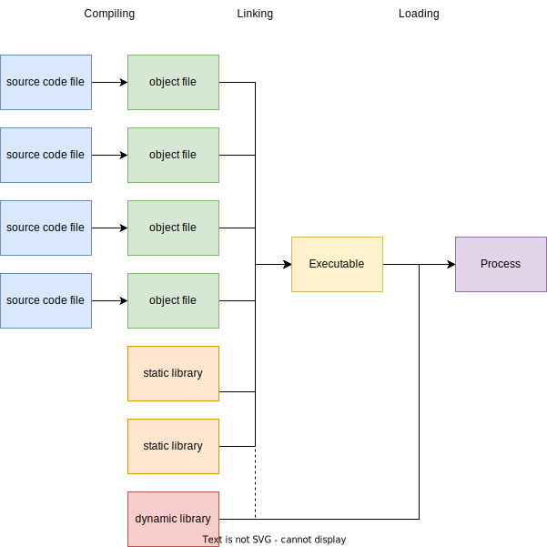
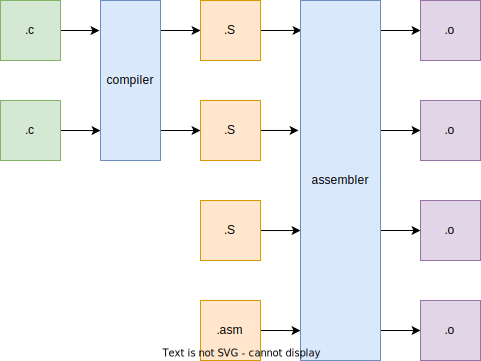
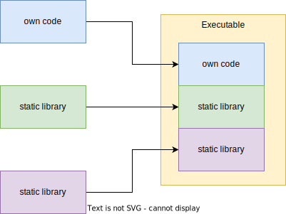
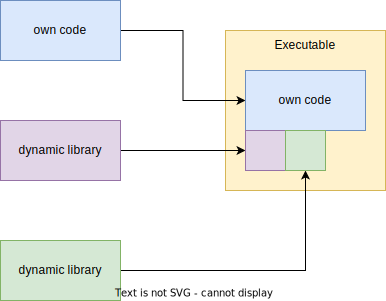
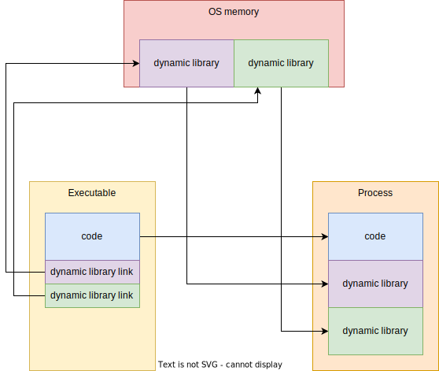
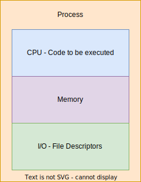
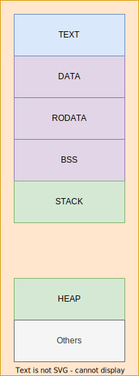
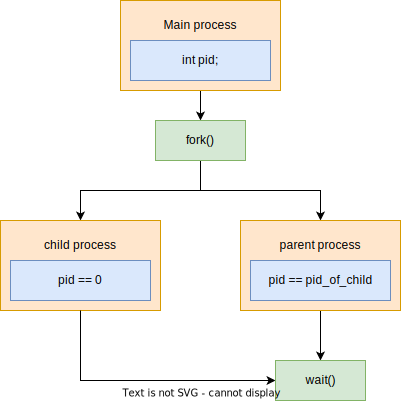
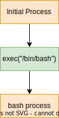

# Introduction

This session is the first that will look into binary applications, more commonly knows as executables.
We will discuss many things, like:

- getting from code to application - compiling, linking and loading
- what is a process
- the memory address space of a process
- how to start a process

# From Code to Application

Every application is written in some form of code.
That code can be compiled or interpreted, in order to do what the developer wants it to do.
When the code is interpreted, another application reads the contents of the source-code, and acts based on those contents.
Interpreted code isn't the focus of the session, but can be interesting for those that want to delve into web security - the browser can be seen as an interpreter of JavaScript code.
Bash and Python are other examples of interpreted languages.
In this session we will focus mainly on compiled code.
For compiled code to become a working application, 3 steps are needed: **compling**, **linking** and **loading**.
Some languages, like C and C++, require an additional step before compiling, **preprocessing**.



The diagram from above represents the process during which some source code becomes a running application.
The steps are detailed below.

## Compiling

Compiling is the step in which a piece of code becomes binary data, readable by the CPU, also called **machine code**.
This step is performed by the compiler.
The best-known compiler for C is **GNU C Compiler (GCC)**.
While tehnically it is not correct to say that we get to a binary file by compiling (assembly would like to say hello), we will leave it like this for now.
Compiling is not enough to have a working application, because we lack the libraries, which do most of the important actions of an application, like I/O, memory allocation and so on.
Those libraries can be standard libraries (libc), OS-specific libraries - the ones for system calls, or libraries written by developers and 3rd parties.
The libraries are added to the binary file in the **linking** step.
The compilation process creates **object files**, which are used in linking.



To compile a `.c` source code, the `-c` flag is used.

```
$ gcc -c code.c
```

The result is a binary object file, that can then be linked.

## Linking

Linking is the step in which libraries are added to our application.
This step is done by the linker.
The result of the linking step is an executable file.
The format of the executable file depends on the operating system that runs it.
Linux uses the ELF (*Execulable and Linkable Format*).
Windows uses the PE (*Portable Executable*) format.
macOS uses the Mach-O (*Mach Object*) format.
This file can then be executed.

The linking step can use 2 types of libraries: static and dynamic.
The linking process itself can be of 2 types, static and dynamic.
Now that confusion has been created, lets explain each of those.

### Static Library

A static library is a library whose entire content is copied, as-is, in the executable.
A static library is created using the `ar` command, and has the **.a** extension.

### Static Linking

Static linking is the process in which **static libraries** are added to the final executable.
This is done in a straightforward manner: copy everything from the libraries to the executable.
This leads to big executables, that generally run faster and can run on other systems even if the libraries are not installed.
However, the statically-linked executables aren't more portable - maybe the library uses something not present on the system.



### Dynamic Libraries

Dynamic libraries aren't copied in the exectable, like their static counterparts.
Instead, they are loaded into memory when needed, and each executable that uses them has a way to access the symbols from those libraries.
The exact process is detailed in the first session of the binary track, TODO.
For now, the only thing you must remember is that all executables use the same dynamic library.

One defining trait of the dynamic libraries is that they must be compiled as PIC (*Position Independent Code*) objects.
More about PIC in the Further Reading section.

Demo: See dynamic libraries used by an executable

To see the dynamic libraries used by an executable, on Linux, we can use the `ldd` command.

```
$ ldd /bin/bash
	linux-vdso.so.1 (0x00007fff72ba3000)
	libtinfo.so.6 => /lib/x86_64-linux-gnu/libtinfo.so.6 (0x00007ff287fb0000)
	libc.so.6 => /lib/x86_64-linux-gnu/libc.so.6 (0x00007ff287d88000)
	/lib64/ld-linux-x86-64.so.2 (0x00007ff288161000)
```

The first and the last libraries, `linux-vdso` and `/lib64/ld-linux-x86-64` are common for all executables.
If you want to find out more about them, you can find them in the Further Reading section.
The other 2 libraries are specific to our executable `/bin/bash`.
The output has the following format:
`<libname>.so.<version> => <path_to_lib> (address where it is loaded)`.
From this output, we can see that `/bin/bash` uses the `libc` and `libtinfo` dynamic libraries.

Another way of seeing what dynamic libraries are used is using the following command:
```
$ readelf -d /bin/bash | grep NEEDED
```

### Dynamic Linking

Dynamic linking is the process during which a dynamic library is "connected" to the executable.
It is the default type of linking.
The resulting executable is smaller in size, but not as easy to port on another system.
In order for it to run on another system, the used dynamic libraries must be installed first.
It is also open to some kinds of attacks.
One of them is the **return-to-libc** attack, which is discussed at the binary track of SSS.



## Loading

Loading is the process in which the program is launched.
During this process, the program code is placed in the OS memory, the dynamic libraries are found and placed into memory, then the control is passed to the application.
A loaded executable is represented in the OS as a **process**.



## Processes

A process can be seen as an abstraction of the system's resources, built for each launched application.
It is important to know that one executable can be launched multiple times, at the same time, resulting in different processes.
Each process has access to the main resources of a system: **CPU**, **memory**, and **I/O devices**, through abstractions.
Those abstractions are there to isolate different processes in a system.



To see what processes are running, the `ps` command can be used.

A simple `$ ps` command whill show only the child processes of the current terminal, and the terminal itself.

```
$ ps
    PID TTY          TIME CMD
   9116 pts/0    00:00:00 bash
  51170 pts/0    00:00:00 ps
```

By default, the PID, and the command used to launch the process are listed.
The TTY and TIME parameters will be ignored, as they aren't relevant.

To display all processes on a system, `$ ps -e` can be used.

### Process Address Space

From a process point-of-view, the entire memory of a system is available, and almost any portion of it can be used.
Behind the scenes, the OS maps the process memory to physical memory, and ensures that two unrelated processes can't see eachother's virtual memory.
The process memory is split into sections, which can contain one or more pages.
Each section can have one or more of the following permissions: **read (R)**, **write (W)**, **execute (X)**.
The main sections of a process address space are:
- **TEXT** - **R-X** - the compiled code of the program, in binary form
- **STACK** - **RW-** - the stack of the application, used for storing local variables and calling functions; more about it in the last session TODO
- **HEAP** - **RW-** - the section where dynamic memory allocations are stored - `malloc` and friends
- **DATA** - **RW-** - the global initialized variables
- **RODATA** - **R--** - the read-only global initialized variables
- **BSS** - **RW-** - the unitialized global variables; this section is somewhat special - it doesn't occupy space in the executable and is filled at runtime; the other sections occupy space in the executable.
- some spicy sections: **GOT**, **PLT**; you can read about them in the [Further Reading](#further-reading) section.



To explore the sections of an executable, `objdump` can be used.
To see the contents of the **DATA** section, run `$ objdump -s -j .data <executable>`

Now, some security stuff: all sections must follow the NX princpile - if a section is writable, it can't be executable.
Why?
You don't want your application to be able to execute code that wasn't written by you, but was injected by someone else.

This can be exploited, if the principle isn't respected, by an attack method called **shellcode**.
Shellcodes represent a big part of the [SSS Binary track](https://security-summer-school.github.io/binary/shellcodes/).

The process address space isn't fixed during the execution of a program; it can be changed by the program itself, using `mmap` to create new entires, and `mprotect` to change the permissions.

#### mprotect

`mprotect` is used to change the permissions of a memory page.
Using `mprotect`, an application can change, for example, a page belonging to the `rodata` section to be writeable.

### File Descriptors

I/O access is usually done through files.
Each process keeps track of the files it has opened using file descriptors.
Opening, closing, modifiying a file in any way can be done only by the OS.
In order for the application to interact with files, it needs to use system calls: `open`, `close`, `read`, `write` and many others.

#### open, openat, close

Before any operation can be performed on a file, it must be opened, using `open`.
An open file can be closed, and the file descriptor freed for other uses, using `close`.

#### read, write

`read` and `write` are the main ways in which a file can be modified.
Each call of `write` modifies the file on the storage environment.
However, there are ways to modify a file, but have those modifications visible only to the current process.

## Creating a Process

Now let's discuss what happens when an application is started.
We consider the case when we are in a terminal (bash) and we launch an executable file.
That executable becomes a process, which is a child of the current bash process.
This is because the bash process launches the exectable, using the `fork` and `exec` system calls.
Basically, what happens is that the bash process duplicates itself, then loads the code of our executable into the duplicate process.

### Fork

The duplication is done by the `fork` call.
The memory of the child process is the same as that of the parent, until it's modified, as are the open file descriptors.
After the `fork` call, the parent must wait for the child process to finish.
Otherwise, it remains active, until it is cleaned-up by the OS.



### Exec

`exec` and its variants are used to change the executable run by the process, or the **image**, as it is called in this context.
`exec` can be used toghether with fork, as done by the terminal, or without it.
One use that you may encounter in the security world is using `exec` to make a process spawn a terminal, after you have gained control of the process.



# Summary

TODO

# Activities

## Tutorial: Static Linking

We want to statically link a simple application using **libc** and our own **libhello**.
Rules to compile the necessary pieces are already in the Makefile:
- a rule tu craete the `main.o` object file - the code of our application
- two rules to create the static library **libhello**

The last step is to add the rule for the executable, `static-linked`.
The required command is
```
gcc -static main.o -L. -lhello -o static-linked
```
Let's break it down:
- `-static` tells gcc to perform a static linking
- `-L.` indicates that a custom path, `.`, the current directory, should be considered when looking for the required libraries - libhello in in the current directory
- `-lhello` indicates that the executable should contain `libhello`

After the command is added in the Makefile, a simple `make` will create our executable.
We can see that it is statically-linked, by issuing the following command:
```
$ file static-linked
```

We should get the following output:

```
static-linked: ELF 64-bit LSB executable, x86-64, version 1 (GNU/Linux), statically linked, BuildID[sha1]=5d2d83de2e46b94bc06a170d17c7f2fc0d29166c, for GNU/Linux 3.2.0, not stripped
```

## Tutorial: Dynamic Linking

We want to dynamically link a simple application using **libc** and our own **libhello**.
We have a modified Makefile, from the previous tutorial.
We now create a dynamic library, `libhello.so`.

We need to add the rule for the executable, `dynamic-linked`.
The required command is
```
gcc main.o -L. -lhello -o dynamic-linked
```
It is almost the same as the previous one, with one difference: we don't need to tell gcc to dynamically-link.

We can see that our executable is dynamically-linked, by issuing the following command:
```
$ file dynamic-linked
```

We should get the following output:

```
dynamic-linked: ELF 64-bit LSB pie executable, x86-64, version 1 (SYSV), dynamically linked, interpreter /lib64/ld-linux-x86-64.so.2, BuildID[sha1]=1f1850ade7c7c04d27507f2f0a6b47819e11a0be, for GNU/Linux 3.2.0, not stripped
```

Before the executable can be run, we need to add the current directory to the `LD_LIBRARY_PATH` variable
```
export LD_LIBRARY_PATH=.
```

## Tutorial: Our own `puts`

The dynamically-linked executables have a nice `feature`: the libraries are loaded at runtime.
Beacuse of this, the actual code of the functions from a library can be changed.
How?
We can specify the loader to load a library before it loads anything else.
That library can overload symbols from other libraries.
In this task, we modify the `puts` function to print the same string, ignoring the string supplied as a parameter.
The first thing needed is to find the header of the function we want to modify.
In our case, `puts` has this header, in `stdio.h`:
```
int puts(const char *s)
```
Then, we write an implemengtation of our own, and create a dynamic library containing that implementation.
At last, we set the `LD_PRELAOD` variable with the **absolute path** to our dynamic library and we run the executable.
```
LD_PRELOAD=<insert_path>/essentials/application-lifetime/activities/my-own-puts/puts.so ./main
```

Instead of printing "Hello World", the program now displays "I do what I want".

## Challenge: Secretive Binary

Someone left an executable, a library and a header file from that library.
It seems the function should print something, but it doesn't want to.
Make it talk.

Submit the flag on CyberEDU.

## Tutorial: Take RO out of RODATA

This task aims to show how to use mprotect, to modify the memory of a process. 
We have a variable declared in **RODATA**.
We will change the permission, so we can write in that variable a new value.
`mprotect` takes 3 arguments:
- a page-size aligned address, in the form of a pointer
- the page size
- the permissions to assign

First, we need to take the address of our read-only variable, and the size of a page.
```C
int page_size = getpagesize();
void *ro_addr = &read_only_var;
```

Then, we align the address of the variable to page-size.
```C
ro_page = ro_addr - ((unsigned int)ro_addr % page_size);
```

Finally, we can use `mprotect` to change the permissions, by adding write permissions.
```C
mprotect(ro_page, page_size, PROT_READ | PROT_WRITE);
```

## Tutorial: File Basics

This task aims to show the main operations that can be performed on a file.
Follow the comments in `basics.c`.

## Tutorial: Fork Me

In this task, we spawn a child process, using fork, wait for its termination, then check the return code.
Follow the comments in `fork.c`.

## Challenge: Blackbox

You have access to a service that seems vulnerable.
See if you can find its secrets.

### Open My Files

It seems the service lets you open some files.
Maybe you find some interesting things there.

### Reveal My Data

Why would someone have a write-only memory zone?
It must be hiding something there.

### If You Want Something Done Well, Do It Yourself

This process hides something.
Can you get a shell and find what it's hiding?

### Hidden

There must be a glitch in the Matrix.
That text doesn't make any sense.

# Further Reading

[PIC](https://en.wikipedia.org/wiki/Position-independent_code)
[GOT and PLT](https://reverseengineering.stackexchange.com/questions/1992/what-is-plt-got)
[vDSO](https://man7.org/linux/man-pages/man7/vdso.7.html)
[ld](https://unix.stackexchange.com/questions/400621/what-is-lib64-ld-linux-x86-64-so-2-and-why-can-it-be-used-to-execute-file)
