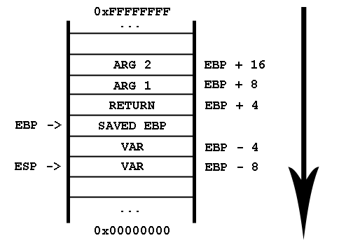
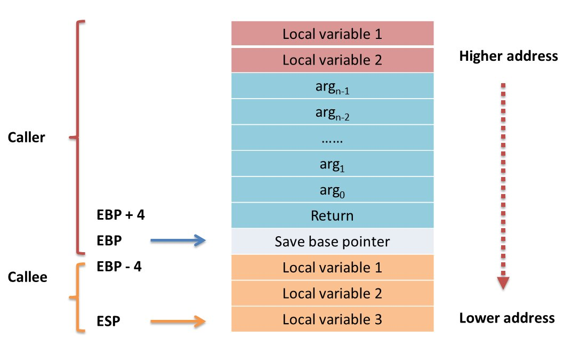

# Taming the Stack

## Introduction

While the last three sessions introduced concepts regarding processes, executables and the means to investigate them, this session will, **finally**, focus on how to manipulate apps to do strange and (sometimes) undesired behaviour.

## Reminders and Prerequisites

- hexadecimal representation
- process address space
- x86 Assembly knowledge: memory addressing and basic commands
- `Ghidra`, `objdump`, `nm`, `gdb`

## Data, Data Everywhere

Up until now, we've learnt that our application (or program) is made out of data and code.
While the code is the engine of the process, as it obviously tells the processor the work that it should do, data is the most interesting (and dangerous) part when it comes to changing the execution of an app.
Why, you might ask?
Well, because it's modifyable;
the majority of the data contained by your program lays around in the `.stack`, `.heap` or `.data` sections of the executable, which makes it **writable**.
And therefore, even more appealing to the attackers.

Attacks on `.rodata` variables are rarely possible due to the protections enforced by the permissions, or lack thereof.
Even though less protected, the `.text` section also gets fewer attacks, as the `W ^ X` security feature becomes the norm.

The gate remains open for malicious endeavours on the `.stack`, `.heap` and `.data` sections, and, today, we'll discuss the most prolific one: the stack.

## Stack

### An Abstract Data Structure

The stack, as a data structure, functions on the LIFO (Last In First Out) concept: one can access only one element at a time, and it's always the last one.

The two operations accepted by the stack data structure are:

- `push` (add one element at the back)
- `pop` (retrieve the last element, while removing it from the stack)

### Real Life Usecase

Enough about abstract data structures for now, let's get down to the OS business!
Every process there is on your system has a stack, used for a plethora of reasons.
While the program stack has a similar behaviour with the abstract data structure from which it got its name, its role is of great interest to attackers and programmers alike:

- **it stores the return address**

   Have you ever wondered how a program knows how to return and execute the next instruction after a function call?
   Here comes the stack.
   The return address (meaning the address of the next instruction after a function call) gets **pushed** on the stack right before entering the function and **popped** at the end of the function.

   ```asm
   call my_func

   ; this is equivalent to

   inc rip
   push rip
   jmp my_func
   ```

- **it saves the content of the registers**

   Let's say we have multiple **nested** functions that all use the same `rcx` register.
   In this scenario, every nested function call overwrites the original `rcx` value (set in the previous method), therefore producing garbage results and even critical errors.
   As a result, the stack is used to preserve the values of the affected registers.

   For example, corrupting registers would look something like this:

   ```asm
   f:
       mov ecx, 1
       call g

       ; this should result in ecx = 2,
       ; however ecx gets corrupted by the function calls
       inc ecx

   g:
       mov ecx, 128
       shr ecx, 2
       call h

   h:
       xor ecx, ecx
   ```

   We should preserve the register value by saving it on stack:

   ```asm
   f:
       mov ecx, 1

       ; preserve the ecx value
       push ecx
       call g
       ; restore the ecx value, WE ARE SAFE
       pop ecx

       inc ecx

   g:
       mov ecx, 128
       shr ecx, 2

       ; preserve the ecx value
       push ecx
       call h
       ; restore the ecx value, WE ARE SAFE
       pop ecx

   h:
       ; no need to save ecx, there are no further function calls
       xor ecx, ecx
   ```

- **it stores local variables**

   Remember the local variables from C/C++?
   The ones that were disposable and didn't preserve their value between different function calls?
   Well, surprise!
   They are stored on the stack.

   For instance, the following C function gets translated to Assembly like so:

   ```C
   void my_func()
   {
        int a = 5;
   }
   ```

   ```asm
   my_func:
        ; preserve the stack frame, a special register
        push ebp
        mov ebp, esp

        ; allocate space on stack for an integer
        sub esp, 4
        ; initialize the integer with 5
        mov [esp], 5

        ; restore the stack pointer and the stack frame
        mov esp, ebp
        pop ebp
        ret
   ```

### `push` and `pop` Under the Hood

As you probably already figured, the fact that the stack operates with its last added value only means that we somehow need to store the exact address of the top somewhere.
Here comes the `esp` register.
Whenever a `push` or `pop` occurs, this register either gets decreased or increased with the size of the value stored on the stack.
You've read it righ: the **`push` operation decreases the `esp` value** and a **`pop` operation increases it**!
That's because the stack grows downwards.



So, the following 4 snippets are equivalent 2 by 2:

```asm
push dword 5
```

```asm
sub esp, 4
mov [esp], dword 5
```

```asm
pop ecx
```

```asm
mov [esp], ecx
add esp, 4
```

## Functions and the Stack

Every function has two classes of values, usually stored on stack, extremely important for its well-being:

1. the return address

1. the parameters / arguments

Meddling with these might get you to a big fat **SEGFAULT** or to great power.

### `ebp`, the Stack Frame

But before discussing that, we have to bring light to another obscure register, `ebp`.
We kind of used it before, in our journey, as it has a great advantage.
It stores the stack pointer value right before the stack begins to hold local variables and preserved register values.
In other words, it keeps a pointer to the stack at the beginning of the function, enabling us to actually move freely through the stack.
We will, now, refer to values stored on it, even though they are not the last ones.

```asm
push ebp
mov ebp, esp

push dword 3
push dword 4
push dword 5

; at this point esp decreased its value with 3 * 4 = 12 bytes
; traditionally we can access the last value only,
; however the stack is like an array, so we will use the pointers
; it offers us

mov eax, [esp + 8] ; eax = 3
mov eax, [ebp - 4] ; eax = 3
```

### The Return Address

The return address of a function is one of the **most targeted** piece of information in an attack.
There is even a special class of attacks that takes its name from it, [ROP](https://security-summer-school.github.io/binary/return-oriented-programming/) (Return Oriented Programming).
Moreover, the return address can also be defined as a **code pointer**, a pointer that stores the address of an instruction.
Remember how the instructions were stored in the code or text section, hence the **code pointer** label.

The reason for this kind of popularity is obvious: it represents one of the rare instances when the program **performs a jump to a code pointer saved on stack**, which, combined with the stupidiy or the laziness of the programmer, can result in a nasty backdoor to the system.

The address at which the return address is usually stored on x86 systems is `[ebp + 4]`.

### The Parameters

The parameters follow a similar story to that of the return address, with a slight modification, though.
On 64-bit x86 they are placed in special registers, if possible.
If the number of parameters is high, they would get transmitted using the stack, just as it happens, on 32-bit x86.

The address at which the first parameter gets stored on 32-bit x86 systems is `ebp + 8`.

The address at which the second parameter gets stored on 32-bit x86 systems is `ebp + 12`.

The address at which the third parameter gets stored on 32-bit x86 systems is `ebp + 16`.

And so on.



## Summary

The both curse and blessing of modern C/C++ code is the absolute control over memory it gives the programmer.
This comes as a doubled edged sword:

- the stack is just an array: we can modify and access it with `push` and `pop`, but also by using the special stack registers, `esp` and `ebp`
- direct access to the return address of the function at `ebp + 4`
- direct access to the parameteres, found either in registers or on stack, at `ebp + 8`, `ebp + 12`, `ebp + 16` etc

making the program vulnerable to ROP attacks.

## Activities

### Tutorial: Function Calls

Use `objdump` to investigate the prologue of the `read_array()` and `print_array()` functions.

```console
root@kali:~$ objdump -d -M intel main
```

Notice how in the prologue, `ebp` saves the `esp` value before the local variables are stored on stack:

```asm
080491a6 <read_array>:
 80491a6:       55                      push   ebp
 80491a7:       89 e5                   mov    ebp,esp
 80491a9:       83 ec 18                sub    esp,0x18
 80491ac:       83 ec 08                sub    esp,0x8
```

What's more, take a closer look at how the parameters are handled:

```asm
 80491af:       ff 75 0c                push   DWORD PTR [ebp+0xc] ; the second argument of read_array()
 80491b2:       68 08 a0 04 08          push   0x804a008
 80491b7:       e8 c4 fe ff ff          call   8049080 <__isoc99_scanf@plt>

 8049213:       8b 45 08                mov    eax,DWORD PTR [ebp+0x8] ; the first argument of print_array()
```

Now, inside `gdb`, let's take a look at where the return address is saved:

```console
pwndbg> info frame
Stack level 0, frame at 0xffffcd30:
 eip = 0x80491ac in read_array (main.c:5); saved eip = 0x8049273
 Saved registers:
  ebp at 0xffffcd28, eip at 0xffffcd2c

pwndbg> x 0xffffcd2c
0xffffcd2c:     0x08049273
```

Let's do the math:

- `ebp` points at `0xffffcd28`
- `ebp + 4` will then point at `0xffffcd2c`
- the value stored at `0xffffcd2c` is `0x08049273`, the same as the one from the saved `eip`

## Further Reading

[Stack Imersion](https://github.com/systems-cs-pub-ro/iocla/blob/master/laborator/content/stiva/README.md)

[Function Calls Imersion](https://github.com/systems-cs-pub-ro/iocla/blob/master/laborator/content/apel-functii/README.md)

[ROP attaks](https://resources.infosecinstitute.com/topics/hacking/return-oriented-programming-rop-attacks/)
